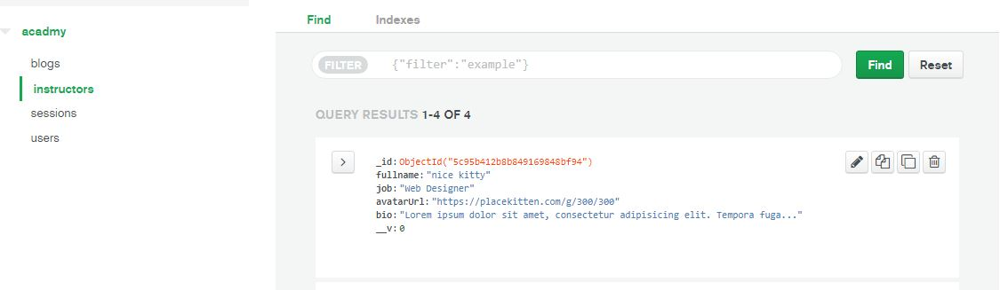

# Simple website

 Simple website with  with nodejs express .

## Getting Started

These instructions will get you a copy of the project up and running on your local machine for development and testing purposes. See deployment for notes on how to deploy the project on a live system.

### Prerequisites

What things you need to install the software and how to install them
*  create  [mongodb Atlas](https://www.mongodb.com/cloud/atlas) account and follow [instructions](https://www.youtube.com/watch?v=_d8CBOtadRA) or through [official website](https://docs.mongodb.com/guides/cloud/atlas/)
*  create  your database and insert collection for   collection named `` instructors ``  for  blogs and insert some documents inside.
    screen shot from Mongodb atlas
    
    


*  create  collection named `` blogs ``  for  blogs and insert some documents inside.
    screen shot from Mongodb atlas
    
    


### Installing

A step by step series of examples that tell you how to get a development env running

* Clone the repo by using ```git clone```.
* Run ```npm install``` on the cloned directory.
* go to project root directory
* create ```.env``` file and store database url | DEVELOPMENT_DB_URL=YOUR DATABASE url

End with an example of getting some data out of the system or using it for a little demo

*Run ```npm start``` to start prject.

## Built With

* [Express](https://expressjs.com/) - Node js web framework 
* [pug](https://pugjs.org/api/getting-started.html) - js template engine
* [passport](http://www.passportjs.org/) - authentication middleware for Node.js
* [mongose](https://mongoosejs.com//) - elegant mongodb object modeling for node.js


## Authors

Ready template made  by  **Colorlib** - [Front end](https://colorlib.com/wp/template/skwela/)

